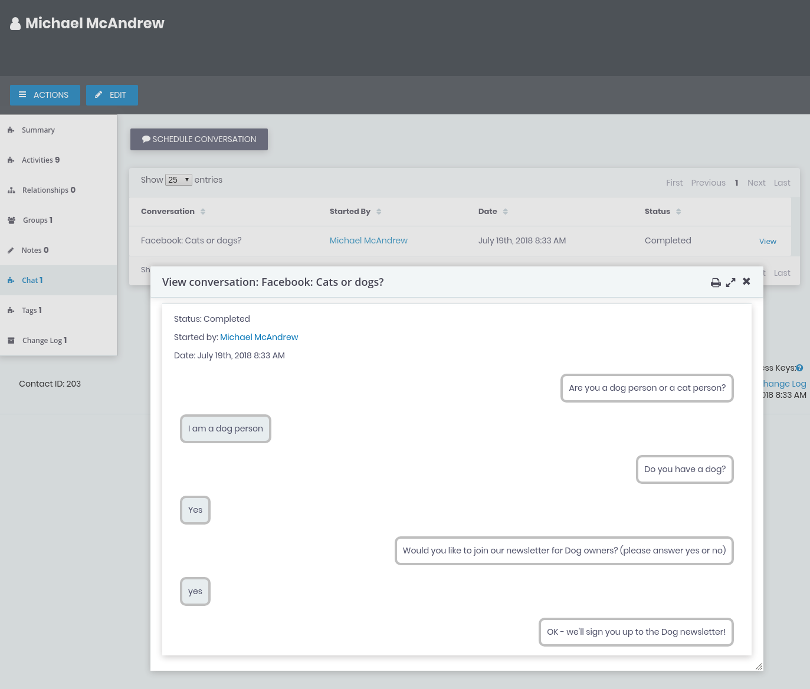

# Chat activities and the chat tab

**Incoming chat**, **outgoing chat** and **conversations** are stored in CiviCRM as **activities**. These activities are visible in a contact's **Activity tab** and other places where you normally find activities (e.g. **Activity reports**).

# Chat tab

Conversations that are made up of various activities can be hard to follow amongst all the other activities in the activity tab. For these reason, Chatbot comes with a **Chat tab** where you can see conversations in a more user friendly format.

